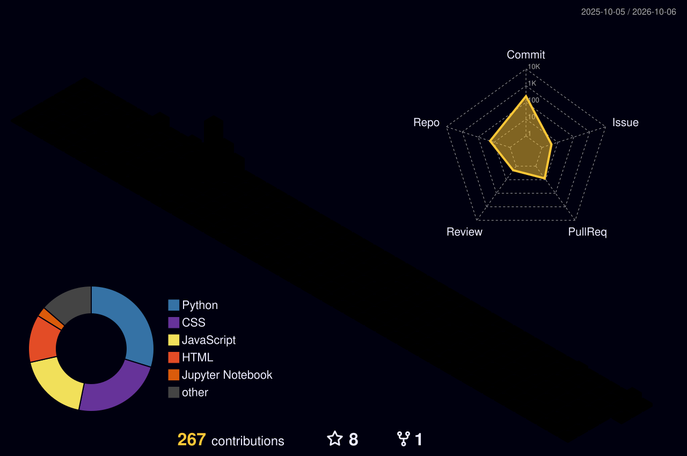

.png)

  
## Hi there! I'm Mohd Umar Farooq 👋

  

- Data and AI engineer who builds backend services, REST APIs and cloud-deployed AI applications on Azure

- Co-Founder of [Octor AI](https://octorai.in), a platform that turns 2,000+ real GitHub issues into structured contribution workflows for open-source contributors

- Former LLM Post Training Intern at Ethara AI (SFT, RLHF, LLM evaluation) | Former AI Engineer Intern at [UFS Networks](https://ufsnetworks.com) | Former RPA Intern at [WarpVelocity Technology](https://warpvelocity.com)

- Open Source Contributor - GSSoC'23, Hacktoberfest'23-'24, Aperture'23

- B.Tech in Computer Science Engineering (AI) @ Jamia Hamdard University | CGPA: 8.27

 

---

<h3 align="left">Connect with me:</h3>

---

<h3 align="left">Languages and Tools:</h3>

 

 

---

## GitHub Statistics

  

 

---

## 3D Contribution Calendar

---

## 🐍 Contribution Snake

---

### 💭 Random Dev Quote

---

